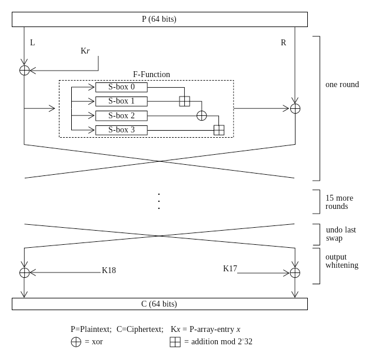

# Pack_It

Encryption + Stegnography

## Blowfish Encryption(Derived)

Instead of making matrix of S-box, I have used index values to select the elements.

## LSB Stegnography

### Prototype 1

Python program based on stegonographical methods to hide files in images using the Least Significant Bit technique.

I used the most basic method which is the least significant bit. A colour pixel is composed of red, green and blue, encoded on one byte. The idea is to store information in the first bit of every pixel's RGB component. In the worst case, the decimal value is different by one which is not visible to the human eye. In practice, if you don't have space to store all of your data in the first bit of every pixel you should start using the second bit, and so on. You have to keep in mind that the more your store data in an image, the more it can be detected.

Problem: large amount of data cannot be embedded.

### Prototype 2

To fix the problem, I increased the resolution which helped to increase the size of image and therefore more data can be embedded.
